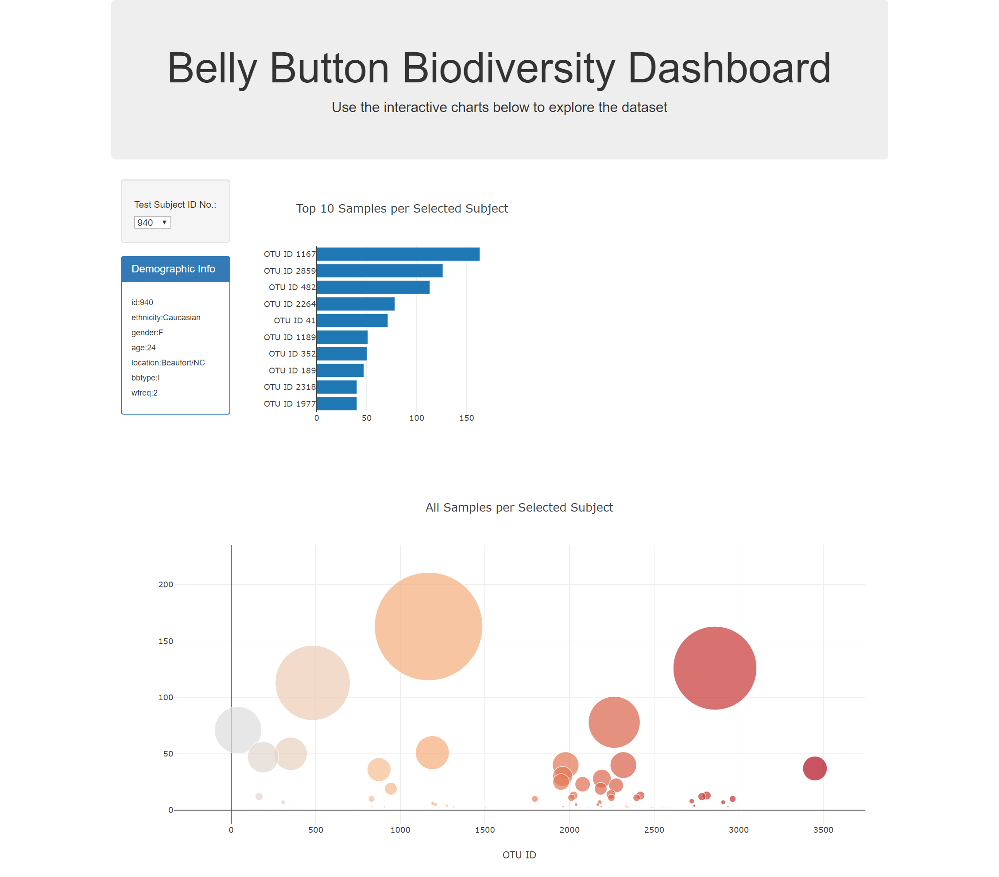

# plotly-challenge

Built an interactive dashboard to explore the provided dataset which catalogs the microbes that colonize human navels.

The dataset reveals that a small handful of microbial species (also called operational taxonomic units, or OTUs, in the study) were present in more than 70% of people, while the rest were relatively rare.

A screenshot of the interactive dashboard is depicted below.

